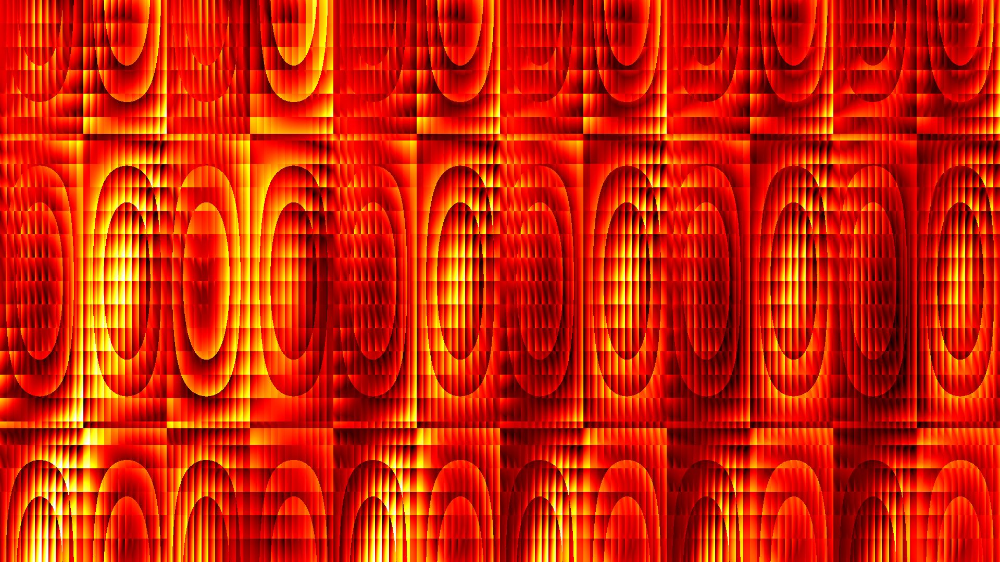
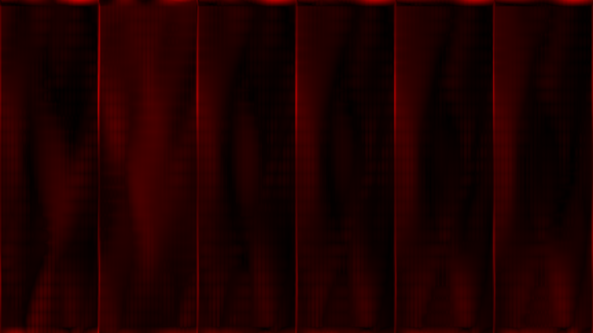

<p align="center">
  
</p>

<h1 align="center">NARC</h1>

<p align="center">Bake neural rendering instead of running it every frame: a GPU-resident cache that replaces per-frame neural inference, 20x to 34x faster.</p>

<p align="center"><a href="https://infinition.github.io/narc/"><strong>Documentation</strong></a></p>

<p align="center">
  <a href="LICENSE"></a>
  
  
  
  
</p>

## Highlights

Measured on an RTX 4070 Ti at 2560x1440, 500 frames with moving camera and light:

| | Full neural pass | Baked cache, multilinear | Baked cache, nearest |
|---|---:|---:|---:|
| GPU time per frame | 65.7 ms | **3.3 ms** | **1.9 ms** |
| Speedup | 1x | **19.9x** | **34.0x** |
| Pipeline rate | 15 fps | 303 fps | 518 fps |
| Quality vs full pass | reference | **48.7 dB PSNR** | 35.8 dB PSNR |
| CPU-GPU copies per frame | 0 | 0 | 0 |

## Overview

Neural rendering passes such as NVIDIA DLSS 5 run a large network on every frame,
which puts a hard real-time cost on each pixel. NARC (Neural Adaptive Rendering
Cache) tests the alternative: evaluate the network once, offline, over the states
a scene can take; keep the result in VRAM; and replace per-frame inference with a
cache lookup.

This proof of concept uses its own network, a 17 -> 128 -> 128 -> 128 -> 64 -> 3
MLP, so the full pass and the cache can be compared exactly, sample by sample, on
the same frames. It validates the mechanism and measures the speed, quality and
memory trade-off. It does not use, modify or accelerate DLSS, and is not
affiliated with NVIDIA.

Everything runs on the GPU in Rust with [cuTile](https://github.com/NVlabs/cutile-rs),
timed with CUDA events, with no host transfer in the measured loop.

## Results

RTX 4070 Ti, CUDA 13.3, 500 frames, `camera-light` sequence, default cache
(24^3 grid, 24 view bins, 12 light bins, 364.5 MB). PSNR is measured against the
full network over every frame.

| Resolution | Full network | Cache, nearest | Cache, multilinear |
|---|---:|---:|---:|
| 1280x720 | 15.77 ms | 0.47 ms, 33.4x, 35.8 dB | 0.76 ms, 20.9x, 48.7 dB |
| 1920x1080 | 37.41 ms | 1.09 ms, 34.4x, 35.8 dB | 1.81 ms, 20.7x, 48.7 dB |
| 2560x1440 | 65.72 ms | 1.93 ms, 34.0x, 35.8 dB | 3.30 ms, 19.9x, 48.7 dB |

Cache size against quality, 1920x1080, `camera-light`, multilinear lookup:

| Grid | View bins | Light bins | Cache | PSNR |
|---|---:|---:|---:|---:|
| 16^3 | 8 | 4 | 12 MB | 33.7 dB |
| 16^3 | 16 | 8 | 48 MB | 40.9 dB |
| 16^3 | 32 | 16 | 192 MB | 48.3 dB |
| 24^3 | 24 | 12 | 364.5 MB | 48.6 dB |
| 32^3 | 16 | 8 | 384 MB | 41.6 dB |
| 32^3 | 32 | 16 | 1536 MB | 52.7 dB |

Findings:

- Lookup time does not depend on cache size; it scales with pixel count.
- Angular resolution matters more than spatial resolution on this scene.
- CUDA Graph replay matches eager launches bit for bit but gives no measurable
  gain: launch overhead is already hidden.
- Nsight Systems over the measured interval: 1520 kernel launches, 160 graph
  launches, 0 HtoD, 0 DtoH. An injected readback is detected.
- Speedups are measured against a tuned FULL path (fastest teacher tile from a
  sweep). A fused or reduced-precision teacher would lower them.

| Full network | Cache, multilinear | Error, nearest | Error, multilinear |
|---|---|---|---|
|  |  |  |  |

Full tables: [Results](https://infinition.github.io/narc/#/Results). Raw data: [`results/`](results).

## How it works

```text
BAKE (once)    cell and bin centres -> teacher MLP -> dense cache in VRAM
                                                          |
RUNTIME        frame counter -> features -> key -> lookup (nearest | multilinear) -> RGB
                                   |
REFERENCE                          +-> teacher MLP -> RGB
```

- Teacher: 17 -> 128 -> 128 -> 128 -> 64 -> 3 MLP, GELU and sigmoid, FP32.
- Cache key: object, 3D cell, view bin, light bin. Multilinear lookup blends 32
  corners; position axes clamp, azimuths wrap.
- Features come from a device-side frame counter, so CUDA Graph replays render
  new frames without uploads.
- Timing: batched frames with one CUDA event pair each, modes interleaved at
  identical frame IDs, JIT compiled up front and checked.

## Features

- FULL, nearest, multilinear and CUDA Graph paths on the same frames
- GPU validation against independent CPU references
- Cache persistence with schema, weight and namespace hashes, per-object invalidation
- JSON and CSV output, generated Markdown reports, error heatmaps
- Zero-copy verification: static scan in tests, Nsight Systems capture range
- Offline pipeline for captured game frames with a depth reprojection baseline

## Quick start

Ubuntu 24.04 (native or WSL2), NVIDIA GPU, CUDA 13.3:

```bash
bash scripts/setup-wsl.sh
source scripts/env.sh
cargo build --release
cargo test --release
cargo run --release --bin narc -- bench --resolution 1920x1080 --sequence camera-light
```

Reference runs:

```bash
bash scripts/bench-main.sh
bash scripts/bench-quality.sh
bash scripts/verify-zero-copy.sh
```

## Captured game frames

`narc-game` reconstructs unseen frames of a captured sequence offline and
compares the cache with depth reprojection from the same keyframes. On mock
sequences, reprojection currently wins (39.97 dB against 35.98 dB on the static
sequence, with less memory). Real captures are the next step.

```bash
narc game validate-capture captures/<game>/static_01
narc game run captures/<game>/static_01 --every 8
```

See [Capture Pipeline](https://infinition.github.io/narc/#/Capture-Pipeline)
and [Capture Guide](https://infinition.github.io/narc/#/Capture-Guide).

## Documentation

- [Installation](https://infinition.github.io/narc/#/Installation)
- [Architecture](https://infinition.github.io/narc/#/Architecture)
- [Benchmark Methodology](https://infinition.github.io/narc/#/Benchmark-Methodology)
- [Zero Copy](https://infinition.github.io/narc/#/Zero-Copy)
- [CLI](https://infinition.github.io/narc/#/CLI) and [Configuration](https://infinition.github.io/narc/#/Configuration)
- [Limitations and roadmap](https://infinition.github.io/narc/#/Limitations)

## Project layout

```text
crates/
  narc-core    scene, teacher reference, cache indexing, config, persistence
  narc-gpu     cuTile kernels, GPU state, CUDA Graphs
  narc-bench   measured loop, runner, reports
  narc-cli     narc binary
  narc-game    captured frame pipeline (CPU reference)
configs/       default, quality, speed
scripts/       setup, reference runs, zero-copy check, RenderDoc export
results/       reference run: JSON, CSV, images, verification output
wiki/          documentation
```

## License

MIT License. See [LICENSE](LICENSE) for details.
